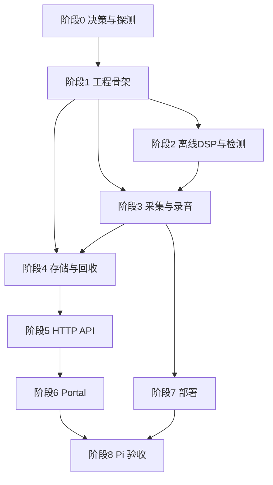

# 开发任务拆分 — Raspberry Pi 打鼾监测系统

依据：`TECH_SPEC.md` v0.6。章节引用如 `§4.3` 均指该文档。

## 使用约定

- 任务 ID：`T<阶段>.<序号>`。`依赖` 列出必须先完成的任务；无依赖的任务可并行。
- 规模：S ≤ 0.5 天，M ≈ 1–2 天，L ≈ 3–5 天（单人估算，含测试）。
- 每个任务的完成标准（DoD）均须包含：相关 `cargo test` 通过、`cargo clippy` 无新增告警、代码里无 TODO 假实现（未实现的分支必须明确报错，不得返回假数据，见 §12）。
- 涉及真实硬件的结论，只有在 Pi 3B 上实测后才能勾选（§3、§13）。

## 里程碑

| 里程碑 | 完成阶段 | 可演示的结果 |
|---|---|---|
| M0 | 阶段 0 | 遗留规格问题有结论；Pi 上确认了麦克风能力、CPAL 时间戳和重采样库可行性 |
| M1 | 阶段 1–2 | 命令行对任意 WAV 跑检测，输出事件列表；所有 DSP/状态机单测通过（无需硬件） |
| M2 | 阶段 3–4 | Pi 上连续录音、分段、gap 登记、事件落库、容量回收，无 HTTP |
| M3 | 阶段 5–6 | 手机/桌面浏览器可看时间轴、回放、跳转、审核 |
| M4 | 阶段 7–8 | systemd 自启，通过 8 小时实测和故障注入，输出验收报告 |

## 进度快照（实现期记录）

> 本节由实现过程维护；`TECH_SPEC.md` 仍是权威依据。勾选表示该条目已实现并有自动化测试覆盖。任何涉及真实硬件的结论（T0.2、T8.x，以及 §3/§13 的实测门槛）在 Raspberry Pi 3B 上验证前不得视为完成。

| 任务 | 状态 | 说明 |
|---|---|---|
| T0.1 | 部分 | 时区、回收周期、`bind_address` 默认 `127.0.0.1`、崩溃一致性、检测盲区不持久化均已在配置与代码中确定；**规格回写待补** |
| T0.2 | 待 Pi 实测 | 需要目标板与 USB 麦克风 |
| T1.1 | 部分 | Cargo 工程与目录已建立；`config.example.toml`、`README.md` 待补 |
| T1.2 | 部分 | 全部 §11 校验已实现并有字段级错误；逐条正反例测试与示例配置校验待补 |
| T1.3 | 部分 | 有界队列、SPSC capture ring、指标计数器完成；journald 日志装配待补 |
| T1.4 | 未开始 | 交叉编译与 CI |
| T2.1–T2.6 | 完成 | 通道选择、精确有理比重采样、逐帧特征、噪声底、状态机、不连续重置与偏移映射 |
| T2.7 | 未开始 | `detect-wav` 离线工具 |
| T2.8 | 部分 | 确定性 fixture 与回归用例已建；单帧耗时基准待补 |
| T3.1–T3.3 | 完成（待 Pi 实测） | 设备协商、CPAL 采集线程、时间线模块；真实设备行为需 T8.1 验证 |
| T3.4 | 进行中 | Dispatcher |
| T3.5 | 部分 | WAV 写入、header 回写、原子 rename、4 GiB 守卫完成；磁盘满/写盘落后的队列联动随 T3.4 |
| T3.6 | 部分 | `.partial` 截尾修头与重命名完成；orphan / `missing` 对账随 T3.4 |
| T3.7–T3.8 | 进行中 | 检测线程集成、优雅退出 |
| T4.1–T4.3 | 完成 | SQLite 迁移与约束、DB writer、容量回收 |
| T5.1–T5.6 | 进行中 | HTTP API 与 Range 音频 |
| T6.1–T6.5 | 未开始 | Portal |
| T7.1–T7.2 | 未开始 | systemd 与安装文档 |
| T8.1–T8.6 | 待 Pi 实测 | 验收门槛 |

### 已记录的实现偏离

- **重采样器**：§10 建议 `rubato`，但 §5.1 要求**精确有理数比**，而 `rubato` 的预分配 API 以 `f64` 表示比例，无法精确表达 44100→16000（441:160）。改为自实现 windowed-sinc 多相 FIR（Kaiser β=8，每相 64 抽头），比例即归约后的整数对 `L:M`，群延迟为解析值。§5.1 的两项指标已用测量测试验证：通带 0–4 kHz 波动 ≤ ±0.5 dB、14.5–15.9 kHz 折返衰减 ≥ 60 dB，五种采集率全部通过。
- **多相滤波器组**：`src/dsp.rs` 另含帧特征与噪声底；`src/detector.rs` 为检测管线与状态机，二者按 §5.2/§5.3 分层而非合并为单一文件。

## 依赖总览

阶段 2（纯 DSP）与阶段 3 的采集/WAV 部分在骨架完成后可由两人并行推进；二者在 `T3.4`（dispatcher）汇合。

---

## 阶段 0：决策与探测

目的：先消除会导致返工的不确定项。

### T0.1 补齐规格遗留决策 — S
依赖：无

以下问题在 §6、§8、§9、§11 中仍未闭环，须在开工相关任务前给出结论并写回 `TECH_SPEC.md`：

- [ ] **日期与时区**：`?date=` 按哪个 IANA 时区转换为 UTC 区间（建议在配置加 `[server] timezone`，默认设备时区）；跨午夜的段归属哪一天（建议：与区间相交即返回）。
- [ ] **容量回收触发时机**：除“片段完成后/启动时”外，增加周期检查（建议每 60 s）和写入中的 free space 检查；定义空间不足时是先回收还是先停止录音。
- [ ] **网络访问控制**：`bind_address` 默认值（建议默认 `127.0.0.1`，由部署配置放开）；PATCH 是否需要简单 token。
- [ ] **崩溃一致性**：rename 与 DB `complete` 之间崩溃的 orphan WAV 处理；`missing` 状态的进入/退出条件。
- [ ] **检测盲区**：是否持久化（§4.3 已列为 MVP 限制，需确认接受）。

完成标准：上述各项在规格中有明确文字，且相关配置键、API 参数同步更新。

### T0.2 Pi 硬件与库可行性 spike — M
依赖：无（需要目标 Pi 和 USB 麦克风）

产出一份 `docs/spike-pi.md`，记录以下实测结果（对应 §14）：

- [ ] 麦克风实际支持的 format / rate / channels；Pi OS 架构（armv7/aarch64）和 Rust target triple。
- [ ] CPAL 在该设备上的 `supported_input_configs()`、实际 period/buffer、xrun 触发行为。
- [ ] **CPAL 是否提供可靠的捕获时间戳**（决定 `§4.3` gap 检测走 `timestamp` 还是降级 `counter`）。
- [ ] 录音中拔出麦克风时 CPAL 的 error callback 行为和恢复方式。
- [ ] 麦克风时钟相对系统单调时钟的漂移（ppm），至少采集 1 小时。
- [ ] 所选 resampler crate 的固定有理比 API、输出长度、群延迟，并对 16/32/44.1/48/96 kHz 做混叠与通带初测（§5.1 指标）。
- [ ] 若 CPAL 不满足需求，给出改用 `alsa` crate 的结论。

完成标准：每条有数据或明确结论；据此锁定 `Cargo.toml` 的 crate 与版本。

---

## 阶段 1：工程骨架

### T1.1 初始化 Cargo 项目与目录 — S
依赖：T0.2

- [ ] 按 §10 目录创建 `Cargo.toml`、`src/` 各模块空壳（含 `dispatcher.rs`、`timeline.rs`）、`web/`、`tests/`、`config.example.toml`、`README.md`。
- [ ] 只启用所需 crate features；release profile：`strip`、`opt-level` 待 T8 实测定。
- [x] 提交 `Cargo.lock`。

完成标准：`cargo build` 和 `cargo test` 在开发机通过。

### T1.2 配置加载与校验 — M
依赖：T1.1

- [x] 解析 §11 的全部配置节（含 T0.1 新增项），路径默认 `/etc/snore-monitor/config.toml`，`SNORE_MONITOR_CONFIG` 覆盖。
- [x] 实现 §11 所列全部校验（Nyquist、`detection_rate_hz == 16000`、`mono_channel_index < channels`、`attack_min_hits ≤ attack_window_frames`、单段 < 4 GiB、队列不小于 2 个 period 等）。
- [x] 校验失败给出明确的字段级错误信息；不静默回退。

测试：每条校验各一个正例和反例；示例配置能通过校验。

### T1.3 公共基础设施 — M
依赖：T1.1

- [ ] 统一错误类型与日志（journald 友好；不记录波形内容，§12）。
- [x] `bounded_queue.rs`：预分配、有界、SPSC，支持“音频槽 + 控制槽”两类容量（§4.3 控制消息永不丢弃）；高水位统计。
- [x] `capture ring`（SPSC）：callback 内无分配、无锁等待，满时只累加溢出计数。
- [x] 指标计数器集合（原子量），供 `/status` 使用（§12 字段）。

测试：满队列行为、控制槽预留、跨线程压力测试（多生产者不允许；单生产单消费顺序正确）。

### T1.4 交叉编译与 CI — S
依赖：T1.1

- [ ] 目标 triple 的交叉编译脚本或 `cross` 配置；在 Pi 上本地编译也能通过。
- [ ] CI 运行 `fmt`、`clippy`、`test`。

---

## 阶段 2：离线 DSP 与检测（可无硬件，对应 §5）

### T2.1 样本格式转换与通道选择 — S
依赖：T1.1

- [x] 反交织，取 `mono_channel_index`，S16→f32（`/32768.0`）。
- [x] 预分配缓冲，跨块可变长输入。

测试：单/双通道、通道索引越界报错、数值精确。

### T2.2 重采样器 — M
依赖：T0.2、T2.1

- [x] 支持 16/32/44.1/48/96 kHz → 16 kHz（§5.1 表）；16 kHz 直通。
- [x] 精确有理比，预分配，状态跨块保持；对固定输入 chunk 的 crate 用累积缓冲适配，不丢尾不补零。
- [x] 暴露 `resampler_delay_in_frames`。

测试：输出长度/比例精确；同一信号不同分块输出一致；混叠抑制 ≥ 60 dB（14.5–15.9 kHz 输入）；通带 0–4 kHz 波动 ≤ ±0.5 dB。

### T2.3 滤波器与逐帧特征 — M
依赖：T2.1

- [x] DC blocker（含重置时的初始化规则）、80 Hz 高通 + 1500 Hz 低通 biquad（系数用 RBJ/双线性变换生成）。
- [x] 10 ms 组帧（环形缓冲，无逐帧分配，不跨 gap 拼帧）。
- [x] 每帧：`level_dbfs`、`band_rms_dbfs`、`band_ratio`、`peak`（§5.2 数值下限和 ε）。

测试：已知幅度正弦的 RMS/dBFS；转折频率约 −3 dB ±0.5 dB、40 Hz 处衰减 ≥ 11 dB；跨块状态连续；静音输入不产生 NaN。

### T2.4 噪声底估计 — M
依赖：T2.3

- [x] 宽带与带内两套 100 桶直方图（−100…0 dBFS，clamp），3000 帧环形窗口，每 100 ms 取 20% 分位。
- [x] 预热（`noise_floor_min_seconds`）、冻结与强制解冻（`noise_freeze_max_seconds`）、长/短 gap 的保留/清空策略。

测试：分位数手算对照；预热期无命中；持续噪声 30 s 后解冻并上升；范围外值 clamp。

### T2.5 候选状态机 — L
依赖：T2.3、T2.4

- [x] `warming_up / IDLE / CANDIDATE / PENDING` 状态与全部转移（§5.3）：attack 窗口、hangover、合并窗口、合并后最短时长判定、`max_event_seconds` 切分并 `continued=1`。
- [x] 强制关闭路径与 `end_reason`。
- [x] 事件特征统计与 `rule_score`（含 `null` 条件）。
- [x] 滤波预热 `filter_warmup_ms` 期间不产生命中。

测试：合成 fixture 覆盖静音、阶跃、短脉冲、周期调制音、风扇式持续噪声；合并边界（799/800/801 ms）；max 时长切分；各 `end_reason`。

### T2.6 不连续与重置 + 偏移映射 — M
依赖：T2.2、T2.5

- [x] §5.4 五步重置流程，输入为 `Gap` / `SegmentStart(格式变化)` / `detector_drop` / watchdog 重启。
- [x] 帧→已存储输入偏移映射公式（含 `anchor_in_offset` 与重采样延迟补偿）。
- [x] 正常段轮转不重置 DSP 状态，只关闭候选。

测试：非 16 kHz 采集下事件起止偏移与真值误差 ≤ 10 ms；注入 gap 后无跨 gap 事件；轮转后噪声底与滤波状态连续。

### T2.7 离线检测工具 `detect-wav` — M
依赖：T2.6

> 规格未明确列出，属于建议新增，用于阈值校准（§5.5、§14）；如不需要可跳过，不影响后续任务。

- [ ] `src/bin/detect-wav`：读 WAV（16–96 kHz、1–2 通道），复用同一检测管线，输出事件 CSV/JSON，并可选输出逐帧特征曲线。
- [ ] 支持命令行覆盖检测参数。

完成标准：对一段测试录音可复现输出，结果与线上检测路径一致（共用代码，不复制实现）。

### T2.8 DSP 测试夹具与回归 — M
依赖：T2.5

- [x] 确定性 PCM fixture 生成器（§5.5 列表）；固定随机种子。
- [ ] 回归用例集覆盖 §5.5 全部验证项。
- [ ] DSP 单帧处理耗时基准（为 Pi 上 `< 10%` CPU 目标提供依据）。

**M1 达成**：T2.1–T2.8 完成。

---

## 阶段 3：采集与录音（对应 §4）

### T3.1 音频设备探测与协商 — M
依赖：T1.2、T0.2

- [x] 枚举 USB capture 设备；多设备且未指定 `alsa_device` 时启动失败。
- [x] 按优先级协商 format/rate/channels（配置值 → 48 kHz → 44.1 kHz；仅 S16_LE；1–2 通道），全部失败则带设备信息启动失败。
- [x] 记录实际 period/buffer。

测试：用 mock 配置列表测协商顺序和失败路径；Pi 上手工验证真实设备。

### T3.2 CPAL 采集线程 — M
依赖：T1.3、T3.1

- [x] callback 只复制 PCM 到 capture ring，不执行其他逻辑；记录块捕获时间戳。
- [x] error callback 转为 gap 事件；ring 溢出累计 `capture_ring_overflow_frames`。
- [ ] 重建 stream：1 s 起指数退避，上限 30 s；拔出期间 `microphone=disconnected`。

### T3.3 时间线模块 `timeline.rs` — M
依赖：T1.1

- [x] 单调时钟 ↔ UTC 锚点（启动及每 60 s），`time_synced`、`boot_id`。
- [x] `wall(o)` 映射函数（含 gap 累加）。
- [x] 相邻块差分的 gap 估算，阈值 `gap_tolerance_ms`；降级为 `counter/unknown` 的路径。
- [x] 壁钟阶跃检测（> 1 s）与 `unsynced → corrected` 修正计算；`clock_drift_ppm`。

测试：纯函数单测——多 gap 的 `wall(o)` 往返；时钟阶跃；漂移不影响相邻差分。

### T3.4 Dispatcher — L
依赖：T3.2、T3.3、T2.6

- [ ] 独占：frame 计数、分段决策（按已存储帧数轮转）、gap 登记、`segment_offset_frames` 标注。
- [ ] 有序消息 `SegmentStart / Audio / Gap / SegmentEnd`；控制消息走保留槽。
- [ ] 轮转原因：`duration / gap / time_step / format_change / size_limit / shutdown / error`。
- [ ] 向录音与检测两路分发；录音队列满 → `queue_overflow` gap，且该块不送检测；检测队列满 → `detector_drop` 并触发检测器重置。
- [ ] 消费者卡死（控制槽也满）→ `degraded` + watchdog 重启消费者。
- [ ] 削波与数字静音统计（`clipped_samples_total`、`signal_state`）。

测试：注入 xrun/溢出/格式变化/时钟阶跃，核对消息序列与轮转原因；控制消息在满压下不丢。

### T3.5 WAV 录音器 — L
依赖：T1.3、T3.4

- [x] `.partial` 顺序追加（64 KiB 批次），按 `header_flush_interval_seconds` 回写头并 `fdatasync`。
- [x] 关闭流程：更新头 → `fdatasync` → 原子 rename → 通知 DB complete。
- [x] 路径 `recordings/YYYY/MM/DD/<UTC-start>_<segment-id>.wav`；4 GiB 提前轮转。
- [ ] 写盘落后/磁盘满：丢块并登记 gap，立即告警，不静默丢样本。
- [x] 仅支持 1–2 通道 `WAVE_FORMAT_PCM`，其他格式启动失败。

测试：header/字节序/rate/channel/帧数；标准播放器可打开；4 GiB 边界（用小阈值模拟）；磁盘满。

### T3.6 启动恢复扫描 — M
依赖：T3.5、T4.1

- [x] `.partial`：按 `block_align` 截尾、修正头、重命名并置 `interrupted`；无法验证的保持原样并告警。
- [ ] orphan WAV（有文件无 DB 行）、DB 有行无文件（`missing`）的对账（按 T0.1 结论）。
- [ ] 恢复后先做一次容量检查。

测试：构造被截断的 partial、header 与数据不一致的 partial、orphan 文件。

### T3.7 检测线程集成 — M
依赖：T3.4、T2.6、T4.2

- [ ] DSP worker 消费检测队列，处理 `SegmentStart/Gap/SegmentEnd`，产出事件。
- [ ] 事件经 DB writer 落库；外键失败进入重试队列并计数 `event_fk_retries`。
- [ ] 检测 panic/错误不阻断录音，状态页可见。

测试：故障注入——让检测器 panic，录音继续且 `detector` 状态降级。

### T3.8 优雅退出 — S
依赖：T3.5、T3.7

- [ ] SIGTERM 顺序：停 stream → dispatcher 刷出 → recorder 完成当前段 → detector 刷出 pending → DB writer 排空；`shutdown_timeout_seconds` 超时则保留 `.partial`。

测试：SIGTERM 后文件完整；超时路径留下可恢复的 partial。

---

## 阶段 4：存储与回收（对应 §6、§7）

### T4.1 SQLite 层与迁移 — M
依赖：T1.1

- [x] WAL、外键、busy timeout，`PRAGMA user_version` 迁移。
- [x] 表：`recording_segments`、`audio_gaps`、`snore_events` 及索引（§7 全部字段）。
- [x] 查询接口：按日期区间查 segment/event/gap，更新审核状态。

测试：迁移幂等；约束（status/review_status 取值）；日期区间边界。

### T4.2 DB writer 线程 — M
依赖：T4.1、T1.3

- [x] 命令队列：`SegmentStarted / SegmentCompleted / Gap / Event`；批量写入，不在采集/DSP 线程里直接操作 DB。
- [x] gap 先在内存登记、段关闭时一并落盘。
- [x] 写失败的重试与告警。

测试：批量顺序性；落库延迟不影响上游；强制写失败后恢复。

### T4.3 容量统计与回收 `retention.rs` — L
依赖：T4.1、T3.5、T0.1

- [x] 统计 recordings 下 WAV/partial 总量（不含 DB/日志）。
- [x] 触发点：片段完成后、启动恢复后、周期检查（按 T0.1）。
- [x] 按开始时间升序删 complete 文件，直到 ≤ target；不删 recording/partial。
- [x] 删除前校验规范化路径在 recordings 根目录内、DB 状态与文件 id 匹配；成功后置 `deleted`，事件与人工标签保留。
- [x] 删除失败 → 尝试下一个；仍超限 `storage_pressure=true`；free space 低于 reserve 且清理无效 → 停止录音并告警。

测试：旧到新；仅 complete；路径穿越拒绝；删文件与 DB 状态一致；失败分支。

**M2 达成**：阶段 3–4 全部完成，在 Pi 上无 HTTP 也能整夜录音并落库。

---

## 阶段 5：HTTP API（对应 §8）

### T5.1 Axum 骨架与状态端点 — M
依赖：T4.1、T1.3

- [ ] 统一错误格式、参数严格校验、同源 CORS、`http_threads` 限制。
- [ ] `GET /api/v1/status`：§12 全部字段；未知状态返回 `unknown/degraded`，不填假 active。

### T5.2 日期/段/事件查询 — M
依赖：T5.1、T0.1

- [ ] `/days`、`/segments?date=`、`/segments/{id}/gaps`、`/events?date=`、`/events/{id}`。
- [ ] 按 T0.1 的时区规则做日期→UTC 区间；返回 `offset_frames` 与 `capture_rate_hz`。

测试：日期边界、跨午夜段、空日期、非法参数。

### T5.3 审核标签 PATCH — S
依赖：T5.1

- [ ] `PATCH /events/{id}` 仅接受 `snore | not_snore | unreviewed`。

### T5.4 音频 Range 端点 — L
依赖：T5.1、T3.5

- [ ] `GET/HEAD /segments/{id}/audio`：`bytes=a-b`、`a-`、`-n`；多段 Range 返回完整 200。
- [ ] 固定缓冲流式读取，不整体加载；`Accept-Ranges`、`Content-Length`、`ETag`（complete/interrupted）。
- [ ] 404 / 410 / 409（recording）/ 416；文件路径只取 DB，不由请求拼接；DB 与实际大小不一致则告警。

测试：206/416、边界字节、并发读取不阻塞录音；大文件内存不增长。

### T5.5 静态 Portal 服务 — S
依赖：T5.1

- [ ] 从安装目录读取 `web/`，路径穿越防护。

### T5.6 API 集成测试 — M
依赖：T5.2–T5.5

- [ ] JSON 结构、Range 206/416、404/409/410、标签校验、日期边界；HTTP 长请求不阻塞采集（并发/故障测试，§13）。

---

## 阶段 6：Portal（对应 §9，原生 HTML/CSS/JS，无构建链）

### T6.1 页面骨架与状态顶栏 — M
依赖：T5.5、T5.1

- [ ] 顶栏：服务/麦克风/录音/检测状态、磁盘用量/上限、告警；服务断开提示。
- [ ] 桌面与手机窄屏布局；无 CDN。

### T6.2 日期导航与时间轴 — L
依赖：T6.1、T5.2

- [ ] 日期列表只显示有录音的夜晚。
- [ ] 时间轴：按本地时间绘制录音覆盖段与候选色块；用 gaps 把 offset 映射到壁钟时间，gap 显示为断点；`unsynced` 段虚线/标注；`interrupted` 段标注。
- [ ] 播放头用同一张 gap 表反向映射，不用 UTC 差值。

### T6.3 播放器与事件列表 — M
依赖：T6.2、T5.4

- [ ] 点击事件 → 选段、加载 `<audio>`、seek 到 `start_offset_frames / capture_rate_hz`（提前约 2 s，不小于 0）。
- [ ] 小时边缘事件选对片段；`timeupdate` 更新播放头；不自动播放。
- [ ] 已删除片段显示“录音已过期”且不可播放。

### T6.4 人工审核与异常状态 — S
依赖：T6.3、T5.3

- [ ] “鼾声/误报”按钮调用 PATCH，失败保留现状并提示重试。
- [ ] 加载、空日期、无设备、录音中断、磁盘告警、服务断开均有明确状态；不显示假数据。

### T6.5 Portal 手工测试清单 — S
依赖：T6.4

- [ ] 日期加载、点击候选跳转、播放头同步、误报审核、过期事件、小时切换；桌面 + iOS/Android 浏览器各走一遍。

**M3 达成**：阶段 5–6 完成。

---

## 阶段 7：部署

### T7.1 systemd 服务与权限 — S
依赖：T3.8

- [ ] `systemd/snore-monitor.service`：专用 `snore-monitor` 用户、非 root、`Restart=on-failure`、`UMask=0027`、仅 DB/录音目录可写、日志到 journald、显式指定 config。
- [ ] 开机自启；USB 存储未挂载时的启动行为（等待或明确报错，不静默写到根分区）。

### T7.2 安装脚本与 README — S
依赖：T7.1、T6.1

- [ ] 安装/升级步骤、目录创建、`config.example.toml` 说明、常用排障命令。
- [ ] README 写明威胁假设：局域网无认证（或 T0.1 的结论）、不要公网映射。

---

## 阶段 8：Pi 验收（对应 §13“实测门槛”）

以下任务必须在 Raspberry Pi 3B 上完成，并把结果记录到 `docs/acceptance-report.md`（含样本量、环境、版本）。

### T8.1 目标板编译安装与能力验证 — S
依赖：T7.2

- [ ] 对应门槛 1：列出麦克风真实 ALSA 能力，验证协商/回退。

### T8.2 8 小时连续运行 — M
依赖：T8.1

- [ ] 录音 + 检测 + HTTP 同时开启，核查 WAV 可播放、文件长度、xrun/gap、CPU/RSS/温度、磁盘写入。
- [ ] 目标：RSS < 80 MiB，DSP 平均 CPU < 单核 10%、峰值 < 25%；超标先 profile 再调整，并据实测选定 `opt-level`。

### T8.3 时间线精度与时钟 — M
依赖：T8.1

- [ ] 对应门槛 7：播放已知节拍声 ≥ 1 小时，比对事件偏移与真值，记录 `clock_drift_ppm`。
- [ ] `stress-ng` 人工压力下检查 xrun/gap 统计、回放对齐与 gap 显示。
- [ ] 对应门槛 8：确认 `estimate_source` 实际取值，`gap_detection_limited` 是否正确显示。
- [ ] 对应门槛 9：断网开机验证 `unsynced` 标注、NTP 同步后的阶跃轮转与修正。

### T8.4 回收、故障与恢复 — M
依赖：T8.1

- [ ] 门槛 5：低配额触发回收，只删最旧 complete，事件保留并显示过期。
- [ ] 门槛 6：拔麦克风、模拟 USB/磁盘故障、`kill -9`、重启，核对状态页与恢复结果。

### T8.5 Portal 移动端实测 — S
依赖：T6.5、T8.2

- [ ] 门槛 4：手机浏览器回放、拖动、候选定位、小时文件切换。

### T8.6 真实录音评估与阈值校准 — L
依赖：T8.2、T2.7

- [ ] 门槛 3：连续多晚采集，人工标注，统计 TP/FP/FN、precision/recall，报告样本数和环境。
- [ ] 用 `detect-wav` 调参，把校准后的阈值写回配置示例，并更新 `detector_version`。
- [ ] 不用合成数据推导识别准确率。

**M4 达成**：T8.1–T8.6 完成并有验收报告。

---

## 推荐的执行顺序

1. **第 1 周**：T0.1、T0.2（并行）→ T1.1–T1.4。
2. **第 2–3 周**：T2.1–T2.8（DSP 线）与 T3.1–T3.3、T4.1（采集/DB 基础线）并行。
3. **第 4 周**：T3.4–T3.8、T4.2–T4.3，在 Pi 上联调，达成 M2。
4. **第 5 周**：T5.x 与 T6.x，可由两人分别做 API 和 Portal，达成 M3。
5. **第 6 周起**：T7.x、T8.x。T8.6 需要多晚数据，建议在 M2 之后就开始后台采集真实录音，不要等到最后。

## 风险与应对

| 风险 | 影响 | 应对任务 |
|---|---|---|
| CPAL 无可靠捕获时间戳 | gap 只能靠计数，丢帧可能被低估 | T0.2、T3.3、T8.3：降级并在状态页明示 |
| Pi 3B 性能不足（RSS/CPU） | 超出 §3 预算 | T2.8 基准、T8.2 profile；必要时 `opt-level`、减少特征 |
| 重采样 crate 指标达不到 | 混叠污染鼾声频带 | T0.2 提前验证，不行则换库或自写 polyphase |
| 默认阈值不适配卧室环境 | 误报/漏报高 | T2.7 工具、T8.6 校准；§14 已标注初值 |
| 规格遗留问题（时区/回收时机/认证） | API 与回收逻辑返工 | T0.1 先于 T4.3、T5.2 完成 |
| 无 RTC 导致时间错误 | 事件时间不可信 | T3.3 的 `time_quality` 与修正；T8.3 验证 |
